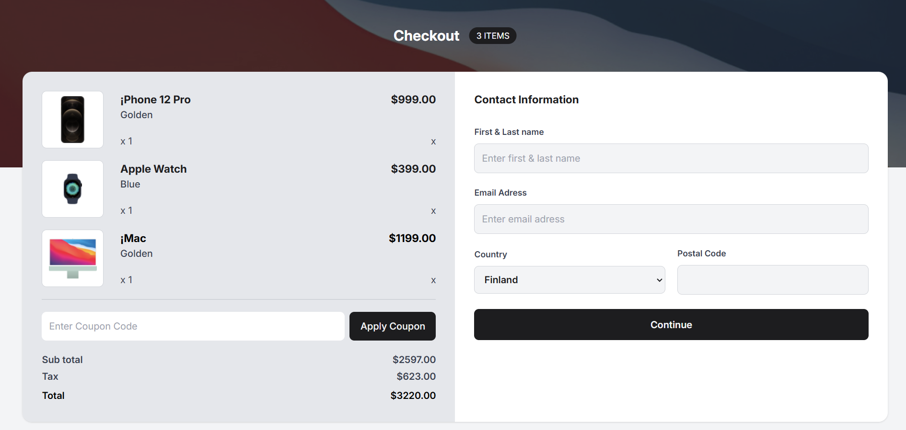

<!-- Please update value in the {}  -->

<h1 align="center">Bustamante | devChallenges</h1>

   Solution for a challenge <a href="https://devchallenges.io/challenge/apple-shop-checkout-page-challenge" target="_blank">Device Shop Checkout</a> from <a href="http://devchallenges.io" target="_blank">devChallenges.io</a>.

  <h3>
    <a href="https://mbustamante05.github.io/device_shop_challenge/">
      Demo
    </a>
     | 
    <a href="https://github.com/MBustamante05/device_shop_challenge">
      Solution
    </a>
     | 
    <a href="https://devchallenges.io/challenge/apple-shop-checkout-page-challenge">
      Challenge
    </a>
  </h3>

<!-- TABLE OF CONTENTS -->

## Table of Contents

- [Table of Contents](#table-of-contents)
- [Overview](#overview)
  - [What I learned](#what-i-learned)
  - [Built with](#built-with)
- [Features](#features)
- [Author](#author)

<!-- OVERVIEW -->

## Overview

### What I learned

I've been practicing a lot with a lot of frameworks and Fullstack technologies, but this challenge made me realize that sometimes we have to go back to the basics because those are really important and fundamental.

### Built with

- CSS custom properties
- Flexbox
- CSS Grid
- [Tailwind](https://tailwindcss.com/)

## Features

This application/site was created as a submission to a [DevChallenges](https://devchallenges.io/challenges-dashboard) challenge.

## Author

- GitHub [Bustamante](https://github.com/MBustamante05)
